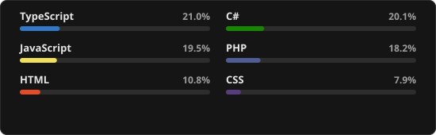
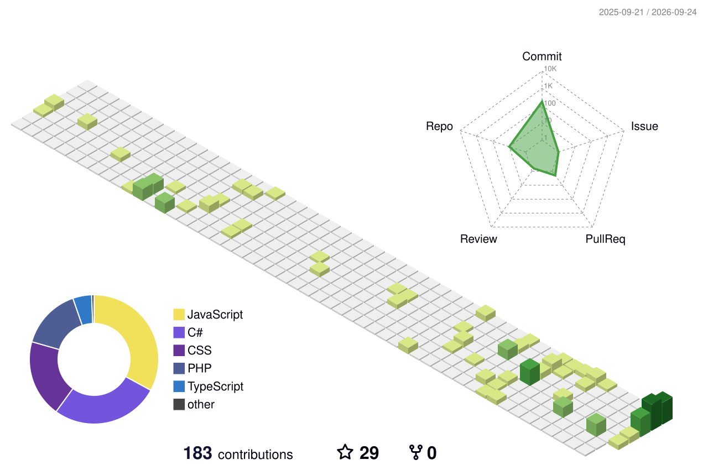

  

<h3 align="center">Software Developer</h3>

 

Building clean, practical web applications — from front-end interfaces to back-end systems and databases.

<h2 align="center">About Me</h2>

###

  💼 Software Engineer at Nansoft, building full-stack web applications 
  🎓 CSE Graduate (2026), IUBAT 
  🚀 Specializing in React, .NET, and SQL Server 
  🌱 Always exploring new tools and best practices 
  📍 Based in Dhaka, Bangladesh

###

<h2 align="center">🧠 Tech Stack</h2>

###

  

###

<h2 align="center">🚀 Featured Project</h2>

###

<table align="center" border="1" cellpadding="20">
  <tr>
    <td align="center">
      <h3>Portfolio (React)</h3>
      
Personal portfolio website built with React, showcasing projects and skills in a clean, responsive layout.

      
      &nbsp;
      
    </td>
  </tr>
</table>

###

<h2 align="center">📊 GitHub Stats &amp; Languages</h2>

###

<table align="center">
  <tr>
    <td valign="middle" align="center" width="49%">
      
    </td>
    <td valign="middle" align="center" width="51%">
      
    </td>
  </tr>
</table>

###

<h2 align="center">🐍 Contribution Snake</h2>

###

  <picture>
    <source media="(prefers-color-scheme: dark)" srcset="https://raw.githubusercontent.com/Hridu06/Hridu06/output/github-contribution-grid-snake-dark.svg" />
    
  </picture>

###

<!--
3D Contribution Graph (disabled) - remove this comment wrapper to enable again

<h2 align="center">🎮 3D Contribution Graph</h2>

###

  <picture>
    <source media="(prefers-color-scheme: dark)" srcset="./profile-3d-contrib/profile-night-rainbow.svg" />
    
  </picture>

###
-->

###

<h2 align="center">📫 Get in Touch</h2>

Open to new opportunities, collaborations, and interesting conversations about technology.

  
  
  
  

###
